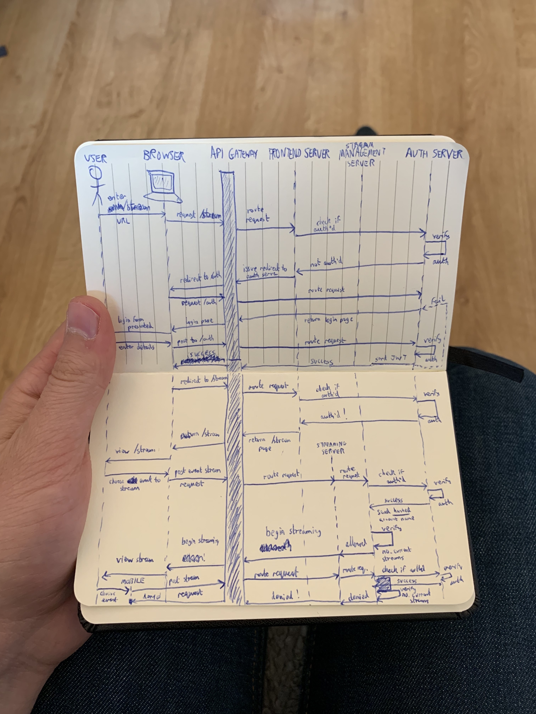

# Architecture

This file details the steps involved in coming up with an architecture, along with justifications for certain design decisions.

## Initial Thoughts

Saturday was spent mostly researching - I familiarised myself with Docker concepts, articles concentrating on API server best practices, and tried to find a way to test-drive the API development. `supertest` was used to achieve this for the most part, however test-driving the server development was not as easy as I'd invisioned.

First, I created a list of possible requirements for this solution. In hindsight, the scope very large for a weekend timeframe.

```
Possible Requirements:

- Performant
    - use Koa (slight performance advantage over Express, more modular)
    - minimize external packages
    - async functions only
    - make use of Node cluster (is this necessary with Docker Swarm or other orchestrator?)
    - use HTTP2
- Scalable
    - use Docker
        - separate services (e.g. database / cache layer / API) into their own containers for independent scaling
    - ability to be orchestrated by Kubernetes or Docker Swarm?
    - database uses something like Google Cloud Spanner?
- Secure
    - implement HTTPS mode
    - sign cookies
    - (minimize external packages again - introduce minimal attack vectors via compromised libs)
    - POST session token before granting access to data
- Maintainable
    - test-driven
    - “dev” mode for local development
        - includes database fake data generation script
    - use LTS version of Node
    - includes README file
    - includes CONTRIBUTION file
    - includes ARCHITECTURE file containing design/package justifications
    - (Koa again, more modular & no unnecessary middleware)
    - ORM? (not a fan, can be more hassle than they’re worth)
- Debuggable
    - sensible app logging (using Bunyan package or equivalent?)
    - managed Kafka stream for aggregating logs
    - named functions to improve stack traces
    - logging dashboard?
- Robust / Resilient
    - (test-driven again, less error-prone)
    - (separation of services into own containers + cluster orchestration tools again)
    - favour managed services - less responsibility for low-level / hardware management
- Privacy
    - user data not persisted in multiple places (e.g. use the userID or hashed version of the username for the media concurrency identifier, not the username itself)
```

## Next Steps

On the back of making the above requirements, I thought about what different services this architecture would comprise, and how they might fit together.

```
- Auth Server Container (auth/jwt handling)
- Auth Redis Container (session data storage)

- Stream Management Server Container (decide whether to allow streaming)
- Stream Management Redis Container (concurrent viewing data storage)

- User Database Container (user/watch-history data storage) - this may be out-of-scope
- Media Database Container (event metadata storage) - this may also be out-of-scope

- Kafka Container (logging/analytics data transmission) - this is a nice-to-have
- Monitoring Dashboard Container (data visualization) - also a nice-to-have
```

The above was still incomplete, and it was only after creating a sequence diagram that the remaining services became clearer.

I created this sequence diagram on paper - admittedly it's a little cramped.



It focussed on a user making requests initially on a desktop web browser, but towards the bottom details a similar set of steps from a mobile device.

Each service has a specific concern, and all are located behind an API Gateway.

In the above example:
- **Browser** - handles the display of the homepage and content-viewing pages
- **Mobile App** - also handles the display of the home screen and content-viewing areas
- **API Gateway** - handles the routing of requests from various clients to the appropriate backend systems
- **Frontend Server** - handles rendering and serving of the homepage and content-viewing pages to the user (for access via browsers)
  - This may also talk to the Stream Service to obtain event information that can be used to server-side render an event viewing page for an authenticated user
- **Stream Service** - handles the streaming of events to users
  - When a user requests to stream an event, this request (containing the eventID) can be forwarded to the Stream Management Service, which will decide whether to permit the action
  - If it is permitted, this service will deal with the logistics of streaming content that is appropriate for the user's current bandwidth (maybe also for their subscription, provided different quality tiers are available for subscription and this subscription tier data is returned from the Auth Service)
- **Stream Management Service** - handles the decision making of whether to permit or deny the user to stream some content
  - In the example, the user's session cookie is forwarded through the various layers to the Auth Service, where the JWT value can be decrypted via the same secret used to encrypt it.
  - The session is checked to ensure it is still active by the Auth Service, and if so, a response is sent back with a hash representation of the username. This can be used as the key for the Stream Management Service's "user concurrent stream" cache
- **Auth Service** - handles user authentication (and authorisation if implemented)
  - *Authentication* - deals with presenting the unified login page for customers. On success, handles generation of an encrypted JWT passed back to the user as a signed "session" cookie (containing an expiry) as well as creating a session in its session cache (also setting the expiry)
  - *Authorisation* - could handle access rights per the user's subscription if multiple subscription levels are rolled out to customers. This data could be consumed by the Stream Service when determining what events the user can see (when rendering via the Frontend Server) what they can view (if they can see and request an event, but are not allowed to stream it) and the quality of the stream (e.g. dependent on whether they have an HD or 4K subscription)

### Auth Service

I tried to implement a user database with both a hashed password and a salt field.

The ideas and methods are understandable, however, a system that stores passwords and user information securely is something that in reality would be developed and maintained by a dedicated team within the company. This is mainly due to cryptography being so easy to incorrectly implement, but also because a whole raft of security issues becomes a concern.

Many professionals recommend third party login systems where possible (such as Google or Facebook login) as this abstracts away a significant amount of the security concerns from the perspective of the business.

Within large organisations however, this will likely be implemented using some form of federated identity setup (SAML / OAuth / ADFS).

Given that these systems will likely already be in place (and that test-driving it proved initially to very mock-intensive and complex) I decided to limit the MVP implementation to doing a simple string comparison on a single user's username and password, no database involvement.

This was with a view to going back at the end if time permitted to implement a proper hashed/salted password storage using either `bcrypt` or Node's native `pbkdf2` (in its `crypto` suite).

The JWT in the session cookie is also currently just a string - `THE_JWT` - and so contains no encrypted user / session expiry information.

Again, this was with a view to revisiting at the end, as the auth service seemed out-of-scope.

### Session and Concurrent Stream caches

I'd invisioned these being simple Redis caches vs. persisting the sessions in a database.

If any of these Redis containers go down, users would have to login again. The potential intermittent loss of session data, though inconvenient, is less business-critical (unless the container was failing frequently enough that users couldn't watch events or had to log in every few minutes).

The effects of such failures might be mitigated by using clustering, assigning hash ranges to specific Redis instances.
That way if one goes down, it's not all sessions/concurrent stream data that gets lost.

Also, on each access to to Session cache the expiry could be updated (along with the expiry value in the JWT).

### Stream Service

Provided the above services were finished, I wanted this service to fake the streaming of event/s to users by frequently firing off messages to a Dockerised Kafka instance, specifically to a topic that the Stream Management Service could consume and use to update the expiry on the Redis cache entry for that user / stream.

The idea was that if the user were to stop streaming on one device, they'd be able to begin streaming seamlessly on another, because the Redis cache entry for that stream will have expired after receiving no updates from Kafka.

This will have reduced their total concurrent stream count (from say 3 to 2) and would have allowed them to immediately start streaming an event (bumping their total back to 3).

### Kafka Instance

I wanted this not just to fulfil the above scenario, but also wanted to try implement some form of monitoring dashboard on a monitoring service subscribed to all log topics. However, as a nice-to-have this was a low priority.

## Design Decisions

### Repo Structure

This repo is structured to be a top-level wrapper around three independent services.

In reality, each service listed in the `/services` directory will be its own repo with its own deployment pipeline.

For this coding test, they were simply kept here for brevity & co-location of the code.

### Koa vs. Express

I chose Koa over Express for a number of reasons:
- Koa has a [slight performance advantage](https://raygun.com/blog/nodejs-vs-hapi-express-restify-koa/) over Express in various benchmarks.
  - Total.js reaches closest to raw Node performance in this benchmark, however the framework appears [slightly bloated](https://bundlephobia.com/result?p=total.js@3.0.1) both in byte size and feature set. It also appears to be nowhere near as mature as either Express or Koa.
- [Koa's core](https://bundlephobia.com/result?p=koa@2.7.0) is smaller than [Express's](https://bundlephobia.com/result?p=express@4.16.4) - you opt-in to the features you want using middleware.
  - This modularity make it more maintainable.
- Express is callback-based, whereas Koa can be used with the modern `async/await` syntax.
  - This again ties into maintainability - async code can be written in a sequential fashion, reducing the cognitive load associated with maintaining the codebase.
- Koa - although not as popular as Express - is just as established / mature.

### Docker Files

#### `.dockerignore`

The approach taken here is to exclude all files initially (with the first line `*`) then opt in files as needed for the eventual image.

This can help prevent accidental leaking of sensitive configuration into the image, such as passwords and secrets in `.env` files.

It can also postively affect build time as only files necessary to run the services are included.

#### `Dockerfile`

Locked down the Node image version to `10.15.3` to ensure the built images are immutable (don't change due to third party changes like a patch or minor version bump).

Favoured `COPY` over `ADD` - the latter is known to be more magic with its URL and tar extracting support.

Only files needed for fetching the dependencies are copied over first, vs. simply copying the whole directory initially (`COPY . .`).
This speeds up the builds as when code changes are made, the whole docker build (including dependency fetching) doesn't have to happen again. Only once the deps have been installed is `COPY . .` called, and even this will only copy the relevant files (owing to the `.dockerignore`).

`EXPOSE` placed near the end of the file, as if this simple value is changed, it would complete quickly but would invalidate all subsequent cached layers.

#### `docker-compose.yml`

All images were locked down to specific versions to improve service immutability (as above).

ENV vars passed to the `config.js` files via `process.env` are parameterised to prevent accidental leaking into the repository (e.g. database configuration and API keys).

Docker networks were specified to make internal service URLs agnostic of specific endpoints, however I couldn't get this to work between containers spun up by different `docker-compose.yml` files. Containers defined within the same file communicated fine over the default bridge network.

Deploy properties are specified to hint to the Docker Swarm orchestrator how many nodes to create and load balance between.
The MySQL and Redis containers only have 1 replica specified to ensure consistency, however this could be increased if appropriate sharding is set up (e.g. Redis clustering with specified hash ranges per cluster).

### `mysql2` vs. `mysql` package

Although marginally less popular, the `mysql2` package has been built from the ground up with performance in mind, and so is [more performant than `mysql`](https://medium.com/epycly/node-js-mysql-driver-benchmarks-2018-86579c402016).

It follows a similar API, and importantly supports parameterised queries to help prevent SQL injection.

## Things to improve:

- [All]
  - Ensure all environment variables passed in to the config.js files come from one source
    - add remaining ENV vars in each config to the related `docker-compose.yml`'s "environment"
    - ensure all of these are parameterised `ENV_VAR=${ENV_VAR}`
    - a `.env` file can then be used for local builds/development
    - and the CI environement can configure the ENV vars for the various pipeline stages
    - this ensures the app conforms to the [12-factor config](https://12factor.net/config) section
  - Additional custom codes should be defined and sent in the responses to successful/failed requests,
  (notably from the Auth and Stream Management services) that would allow the messages to be decoupled from the logic that handles the success/error logic on the consumers. These codes would likely exist in a database somewhere for reference, or at least be well documented internally.
  - HTTPS mode (for production)
  - Ensure services make use of HTTP2 protocol
- [Auth Service]
  - Have this communicate to the MySQL and Redis Docker instances over the default Docker network
  - Complete password hashing / salting mechanism or use OAuth (or equivalent)
  - On successful authentication
    - use the ENV var secret to encrypt a JWT containing user data / a signature for the `session` cookie
    - create a session entry in the Redis session cache, with an expiry equal to that specified for the JWT token
    -  Implement Redis clustering, test in Docker Swarm mode
- [Stream Management Service]
  - Ensure successful communication to the Auth Service via Docker network
  - Ensure session cookie is propagated through to the Auth Service
  - On successful response from Auth Service (response should include hash of username) check Redis for events against the hash cache key
    - if less than 3 events registered, add the event and respond to the Stream Server with a 200/204 status code
    - otherwise respond with a 401 and leave the Redis value unchanged
    - send message to Kafka instance to log either outcome
- [Kafka Service]
  - Create / dockerise / network etc.
- [Stream Service]
  - Link with Stream Management Service via Docker network
  - Ensure session cookie forwarded to Stream Management Service
  - On successul response to an event streaming request from the Stream Management Service, send semi-frequent messages to the Kafka Service (for the stream keep-alive proof of concept) that the Stream Management Service can consume to keep its concurrent stream cache up-to-date for the user.
- [API Gateway]
  - Configure to ensure requests reach the correct services

## Final Thoughts

### API Versioning

Bugs inevitably happen that need rectifying and businesses want to ship new features as fast as possible.

To facilitate these, an API versioning system must be put in place.

The setup for web browsers is fairly simple.

If a new feature is added, this is almost entirely handled by the backend services - if you want a new area on the website, the back-end services can be modified to facilitate this, the Frontend Server can be modified to reference the updated APIs, and the web page can be served to the customer.

The API versioning could especially come in handy if A/B testing new features.

For a mobile client, this could be more difficult, as when apps ship they tend to have hard-coded references to the APIs they wish to hit.

To mitigate this, Netflix architected an API version resolution layer that resolves a fuzzy API version (e.g. a `package.json`-esque minimum/maximum semver version no. like `^7.4.0` or `~2.8.0`) and returns the latest API permitted by that.

This means when making API changes (fixes or features) they weren't intrisically linked to the updating and release of new mobile app versions, improving the speed at which they could ship.

### TDD Issues

I had to decide at what level to mock:
- Mocking the Redis client package functions would allow for easy local-code refactoring
  - e.g. allow logic that lives in the route to be moved into a separate file of accessor functions
- Mocking the accessor functions instead of the underlying client would make testing easier and allow easier switching of the package, but reduces refactoring confidence
  - ✅very simple to replace a local file export with a mock implementation using Jest
  - ✅can swap the underlying Redis client package for another one without breaking tests
  - ❌if alternate Redis client introduces a subtle bug, this will not be caught by the higher level consumer tests

The pragmatic approach may have been to mock the accessor methods and assume a contract between the internals of these methods to conform to their consumers expectations.

This does mean the testing is less end-to-end, but developer time can be saved not figuring out how to mock the third-party libraries.

Tests can be added to the accessor methods if there is time, but ultimately the accessor methods shouldn’t have complicated logic within them so this shouldn’t be much of a problem.

### Progress

Given maybe two more evenings to work on this, the following areas of "things to improve" from above may have been finished and the services fully talking to each other:
- `[All]`
- `[Auth Service]`
- `[Stream Management Service]`

In this instance, I focussed too heavily on trying to learn how to test-drive API server development, rather than fleshing out the solutions.

Given that Saturday was mostly researching, I greatly limited the time I had to complete this challenge.

However, this has also been a fantastic learning experience.

### Stream Service

I read an interesting blog post on [“The Super Bowl Problem”](https://www.multichannel.com/blog/multicast-unicast-and-super-bowl-problem-373220)

If Dazn manages that kind of traffic, a setup where users think they have full control over their stream can be used employing multicast instead of unicast.

I.e. multiple users within a geographically similar area (if they are watching the same event) can subscribe to the same broadcast channel If any of the users pauses or rewinds, the system can either create a unicast channel for them, or join them onto an existing multicast channel with other users watching from a similar point.
Users will theoretically never be aware of each other being on the same broacast channel.
